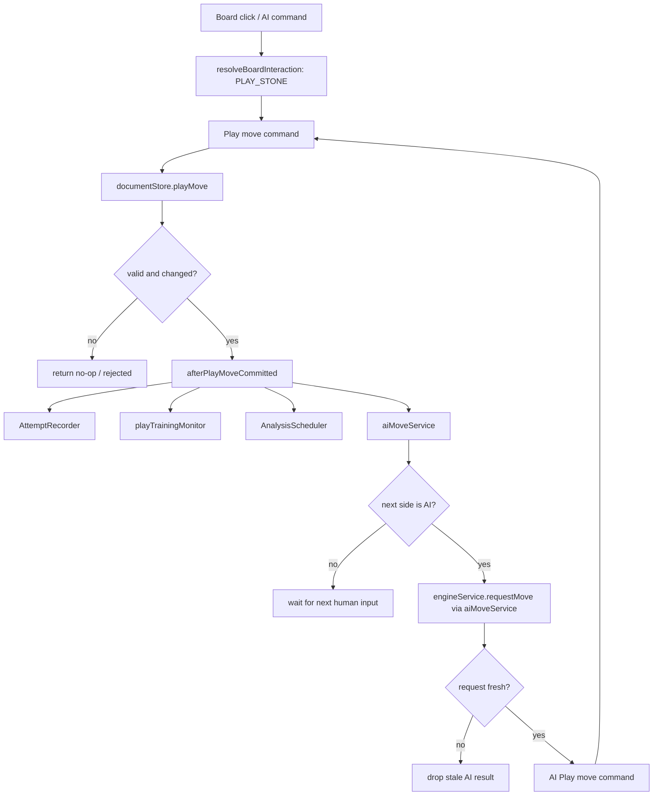
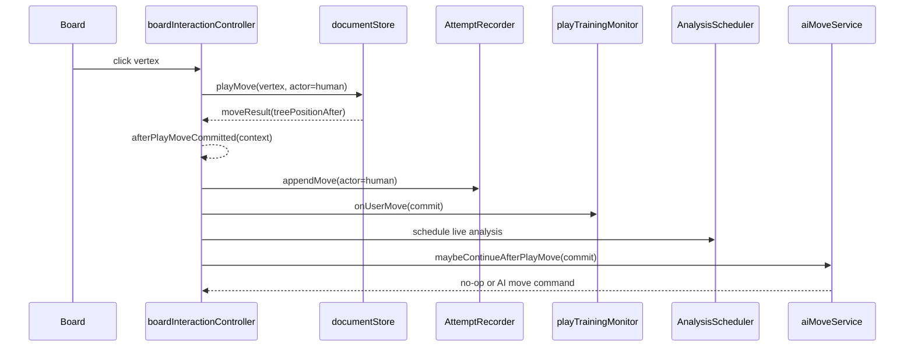
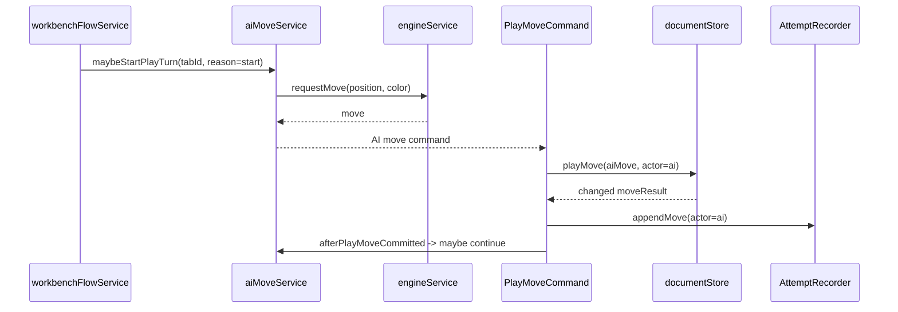
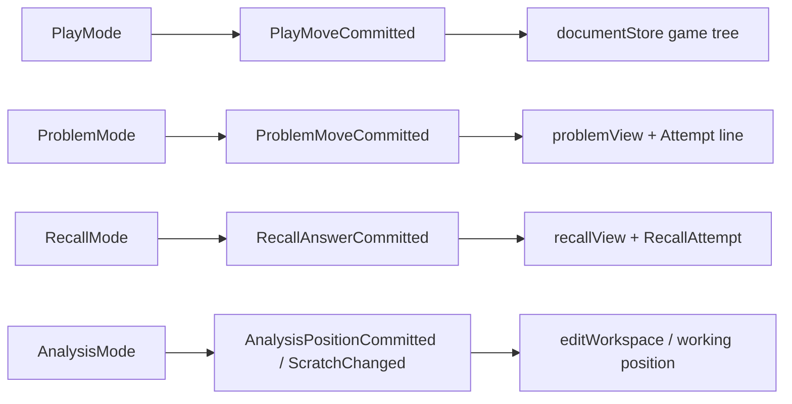

# PlayMoveCommitted 架构说明

> 文档类型：Workbench Play Mode 棋盘写入边界设计
> 状态：v0.2 draft
> 日期：2026-05-29
> 关联文档：
> - `docs/architecture/gabaki-sabaki-training-architecture-v0.5.md`
> - `docs/product/sabaki-training-prd.md`
> - `docs/architecture/position-source-mutation-contract.md`
> - `docs/design/workbench-mode-orchestration-contract.md`

---

## 1. 背景

当前 Workbench Play 落子路径已经能工作，但 `boardInteractionController` 的
`playMove` 分支同时承担了几类职责：

```text
棋盘点击解析
→ documentStore.playMove 写 SGF game tree
→ attemptService.appendMove 记录 TrainingAttempt
→ playTrainingMonitor.onUserMove 评估训练事实
→ aiMoveService.maybePlayAiMove 请求 AI 应手
→ AI 返回后再次 documentStore.playMove
```

这让“普通交替落子”与“训练记录、评估、AI 应手”耦合在同一段控制流里。新的设计把
Play 的核心写入事实标记为 `PlayMoveCommitted`：它不是一个新的 WorkbenchMode，也不是 UI
事件，更不是当前阶段必须实现的正式领域事件类型。它只是 `documentStore.playMove` 成功写入
game tree 后的架构提交点 / lifecycle point，用来说明哪些后置服务可以被触发。

---

## 2. 目标

`PlayMoveCommitted` 的目标是明确三层边界，而不是引入复杂事件模型：

```text
主线：
  验证当前 Play 落子是否合法，并写入 game tree。

提交点：
  documentStore.playMove 已经成功返回 changed moveResult。

订阅副作用：
  Attempt 记录、训练评估、AI 应手、后台分析调度。
```

核心原则：

- Play Mode 的主写入事实是 `documentStore` / SGF game tree。
- `Attempt` 是 Play move 的训练记录订阅者，不是落子合法性和棋树推进的主条件。
- `aiMoveService` 是 AI turn policy + engine request orchestration 的 owner；不新增独立的薄 `AiTurnScheduler`。
- AI 首手、AI 应手、AI vs AI 自动推进都必须重新进入同一条 Play move commit 主线。
- Play Mode 不显示 territory / compare / analysis overlay；`overlayRegion` 不参与 Play move fan-out。
- Play 中可以后台调度 analysis，用于后续 `MoveEvaluation` / `BadMove`，但这不是 overlay 显示。
- 当前阶段不要求 event bus，不要求持久化 event，也不要求一个字段完备的 `PlayMoveCommitted` TypeScript 类型。

---

## 3. 非目标

`PlayMoveCommitted` 不覆盖以下动作：

```text
ProblemMoveCommitted      Problem Mode 做题线提交，主写入是 problem runtime + Attempt line。
RecallAnswerCommitted     Recall Mode 答案提交，不是棋树落子。
AnalysisPositionCommitted Analysis Mode scratch / working position 编辑，不写 Attempt.userLine。
```

这四类动作可以共享棋盘 intent 解析，但不能共享同一个写入 executor。

---

## 4. 轻量提交点

第一阶段实现可以只是一个命名清楚的后置处理函数：

```ts
const moveResult = await documentStore.playMove(vertex, {player})

if (isChangedPlayResult(moveResult)) {
  await afterPlayMoveCommitted({
    tab,
    actor,
    moveResult,
    treePositionBefore,
  })
}
```

`afterPlayMoveCommitted` 的输入只需要足够支撑后置服务：

```ts
type PlayMoveCommitContext = {
  tab: WorkbenchTab
  actor: 'human' | 'ai'
  moveResult: {
    treePosition: string
    pass?: boolean
    capturing?: boolean
    suicide?: boolean
    ko?: boolean
    doublePass?: boolean
  }
  treePositionBefore: string
}
```

这个轻量 context 是实现辅助，不是必须长期稳定的领域模型。需要 `move`、`color`、`moveIndex`
时，可以由后置 handler 从 `vertex`、`moveResult`、当前 board/player、active attempt 中派生。
只有当多个模块反复复制这些派生逻辑、测试夹具明显变复杂时，再考虑收敛为正式类型。

---

## 5. 总体时序



注意：图中没有 `overlayRegion`。Play move commit 不更新 overlay。只有进入或离开 Analysis
Mode 时，mode transition effects 才能通知 overlay region 清理或允许 analysis overlay。

---

## 6. 人类落子时序



人人对局也可以调用 `aiMoveService` 的判断入口，但结果必须是 no-op：

```text
playerConfig.black === 'human'
playerConfig.white === 'human'
→ aiMoveService sees next color is human
→ no engine request
→ no AI move commit
```

---

## 7. AI 首手与 AI 应手

AI 不应绕过 Play move 主线直接写棋树。合理路径是：



这解决人执白 / AI 执黑时的首手问题：开局创建 attempt 后，由 `aiMoveService`
检查当前 game tree 的 next player，如果黑方由 AI 控制，就请求黑棋首手，然后仍通过
`documentStore.playMove` 提交。

---

## 8. Subscriber 边界

| Subscriber | 读取 | 写入 | 允许条件 | 禁止 |
| --- | --- | --- | --- | --- |
| AttemptRecorder | commit context, active attempt | `TrainingAttempt.userLine`, `moveActors` | active attempt 且 attempt 未冻结 | 决定落子是否合法 |
| playTrainingMonitor | commit context + analysis result | `MoveEvaluation`, `BadMove`, runtime evaluation cache | active attempt | 写 game tree，触发 overlay |
| AnalysisScheduler | `treePositionAfter` | analysis queue/cache | Play move committed | 显示 overlay |
| aiMoveService | commit context, playerConfig, current tree position | `pendingAiMove`; engine request; returns AI move command | next side is AI and autoplay allowed | 直接写 Attempt、直接写 overlay、绕过 Play move command |

`overlayRegion` 不在表中。Play/Problem/Recall 的 overlay projection 是 `off`。

---

## 9. Store / Service 使用矩阵

| 层 | Play move commit 点中的角色 |
| --- | --- |
| `documentStore` | 主写入：提交 SGF game tree move，返回 treePositionAfter 和 move metadata。 |
| `workbenchStore` | 读取 active tab、mode、playerConfig、activeAttemptId；不由 move commit 直接 patch mode。 |
| `trainingRuntimeStore` | 存放 pending AI request、pending evaluation、visible bad move ids 等 transient companion state。 |
| `trainingRepository` | 由 attempt/monitor 服务写入 Attempt、MoveEvaluation、BadMove。 |
| `attemptService` | 记录 committed move 到 active Attempt；冻结后拒绝写入。 |
| `playTrainingMonitor` | 接收 commit context 和 analysis update，生成训练评估事实。 |
| `aiMoveService` | 判断 AI turn、管理 freshness、请求 engine move、返回 AI move command。 |
| `engineService` | 只作为 engine adapter 被 `aiMoveService` 调用；不应在 Workbench Play 主线中直接写棋树。 |
| `analysisService` | 后台调度 live analysis；其结果供 monitor / panels 消费，不在 Play 显示 overlay。 |
| `overlayRegion` | 不参与 Play move commit；只在 mode transition 时清理或允许 analysis overlay。 |

---

## 10. 与其他 mode 的边界



Mode-specific restrictions:

- Play: writes game tree; may record Attempt; may schedule analysis; may invoke AI; overlay off.
- Problem: writes problem runtime / Attempt line; AI opponent constrained by problemArea; overlay off.
- Recall: records recall answer; must not mutate game tree or Attempt.userLine.
- Analysis: writes scratch/working position; may show analysis overlay; must not mutate Attempt.userLine.

---

## 11. Implementation Notes

The current implementation can migrate incrementally:

1. Keep `executePlayInteraction` as the low-level document write adapter.
2. Add a small `afterPlayMoveCommitted(...)` function or equivalent local pipeline after changed `documentStore.playMove`.
3. Move attempt append, monitor, analysis scheduling, and AI reply into named post-commit handlers.
4. Change `aiMoveService` from "maybe play after attempt line" to "maybe continue from committed game tree position".
5. Route AI-generated moves back into the same Play move command path.
6. Add tests for:
   - human-human no engine request;
   - human black vs AI white reply;
   - AI black first move before human white;
   - stale AI result ignored;
   - Play move does not enable or update overlay;
   - frozen attempt rejects Attempt append but does not corrupt game tree.

---

## 12. Open Questions

- Should a Play move be allowed to commit to game tree when active Attempt append fails because the attempt is frozen, or should the command preflight reject before document write? Preferred: preflight reject when active tab claims an active frozen attempt.
- Should background analysis run after every human and AI move in Play, or only when an active attempt exists? Preferred: run when active attempt exists or live analysis is explicitly enabled.
- Should AI vs AI auto-play be allowed in Workbench Play v1? Preferred: support the model but gate with explicit max-move and user interruption limits.
