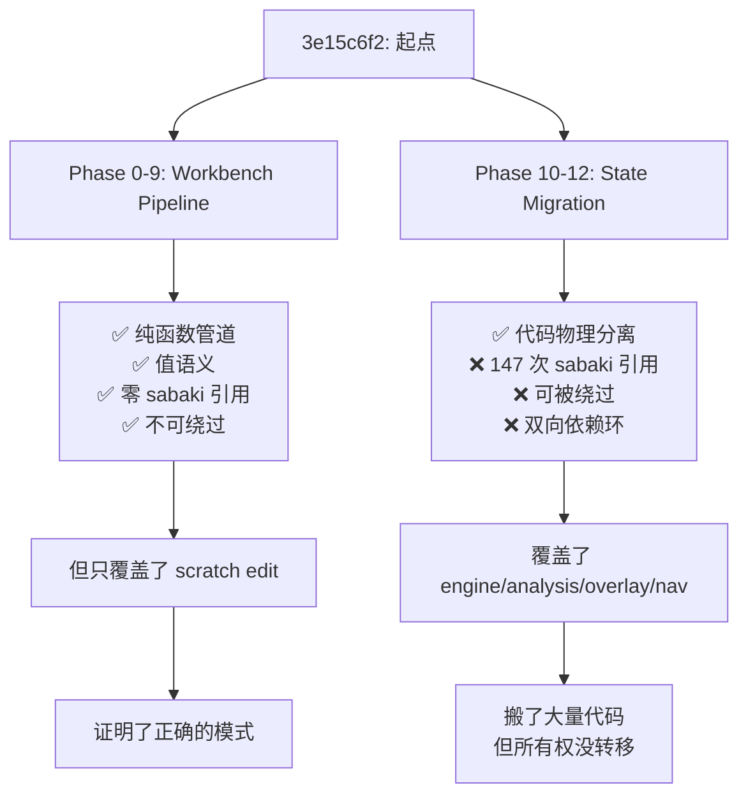

# 评估：3e15c6f2 以来的所有权迁移提交（扩展版）

## 结论先行

扩大范围后，情况变得更有意思了。这 ~32 个提交实际上分成了 **两条截然不同的路线**，它们对"所有权"的理解和实现方式完全不同：

| 路线 | 提交范围 | 策略 | 对所有权的贡献 |
|------|----------|------|----------------|
| **Workbench Pipeline**（Phase 0-9） | `3e15c6f2..c4e209a9` | 纯函数 + 值语义 + 契约路由 | 🟢 **真正的语义约束** |
| **State Migration**（Phase 10-12） | `c4e209a9..HEAD` | 搬代码 + closure 捕获 sabaki | 🔴 **换皮为主** |

**反直觉的发现**：Phase 0-9（workbench pipeline）根本没试图"迁移状态"，但它对所有权的贡献远大于 Phase 10-12。因为它约束了 **修改状态的路径和语义**，而不是搬运状态的物理位置。

---

## Part 1：Workbench Pipeline（Phase 0-9）— 做对了的部分

### 核心架构

```
用户点击棋盘
    ↓
createBoardInteractionContext()    ← 纯函数，从 state 提取最小快照
    ↓
resolveBoardInteraction()          ← 纯函数，零 sabaki 引用，输出 intent + contract
    ↓
executeBoardInteraction()          ← 路由器，按 contract 分发
    ↓
executeScratchEdit()               ← 纯执行器，操作值对象，返回 diff
    ↓
sabaki.commitEditResult()          ← 唯一的 setState 写入点
```

### 为什么这是真正的所有权约束

#### 1. 纯函数 resolver — 物理上不可能绕过语义

```typescript
// resolveBoardInteraction.ts 第 6-8 行
/**
 * This function must not import sabaki.js, read global state, or produce
 * side effects. All information flows through the input parameters.
 */
```

这不是建议，是物理约束。`resolveBoardInteraction` **没有 sabaki 引用**，不可能 `sabaki.setState()`。它只能接收一个 `ResolverInput`，返回一个 `BoardInteractionResult`。你无法绕过它的逻辑去直接改状态——因为它根本碰不到状态。

#### 2. MutationContract — 显式声明写权限

```typescript
export const MUTATION_CONTRACTS = Object.freeze({
  PLAY_MOVE: 'playMove',
  SCRATCH_EDIT: 'scratchEdit',
  RECALL_ANSWER: 'recallAnswer',
  VARIATION_MOVE: 'variationMove',
})
```

每个操作必须声明它打算写哪种 durable state。executor 检查 contract 是否匹配，不匹配直接拒绝：

```javascript
if (result.mutationContract == null) {
  return {handled: false, changed: false, reason: 'no mutation contract'}
}
if (result.mutationContract === 'scratchEdit') {
  return executeScratchEdit(result, context, deps)
}
```

这就是你说的 **"不得任意掠过语义"**。没有 contract，你什么也写不了。

#### 3. 值语义 executor — 返回 diff，不直接 setState

`executeScratchEdit()` 不调用 `sabaki.setState()`。它接收一个 snapshot（值对象），返回一个新的 snapshot：

```javascript
case 'place-black-stone': {
  updated = placeBlackStone(snapshot, vertex)  // 纯函数，返回新值
  break
}
return {handled: true, changed: true, tab, snapshot: updated}  // 返回 diff
```

**写入权被集中到了唯一的一个 commit 点**（`sabaki.commitEditResult()`）。这意味着所有的分析编辑操作都必须走这条路：

```
resolver → executor → commitEditResult() → setState
```

任何试图跳过 resolver 或 executor 的代码，根本拿不到正确的 snapshot 格式来写入。

#### 4. sabaki 引用计数：零

| 模块 | sabaki 引用 |
|------|-------------|
| `resolveBoardInteraction.ts` | **0** |
| `executeBoardInteraction.js` | **0** |
| `scratchEditInteractionExecutor.js` | **0**（注释里提到 sabaki 2 次，代码里 0 次） |
| `createBoardInteractionContext.ts` | **0** |
| `workingPosition/*.js` | **0**（只引用 `@sabaki/go-board` 包） |
| `contracts/*.ts` | **0** |

**整个 workbench 子树是一个 sabaki-free zone。**

> [!TIP]
> 这些模块可以被单元测试、可以被复用到其他围棋应用中、可以在 Web Worker 里运行——因为它们不依赖任何 singleton state。这是真正的所有权结果。

### 但 workbench 也有未完成的部分

workbench pipeline 只覆盖了 **scratch edit 交互** 这一条路径。它没有覆盖：
- `play` 模式下的下子（Phase 8 `playMove` 路径仍然 fall through 到 sabaki.js 的 async handler）
- engine 生命周期管理
- overlay 状态切换
- 导航和历史

所以 workbench 证明了 **"正确的模式是什么"**，但覆盖面有限。

---

## Part 2：State Migration（Phase 10-12）— 未兑现的承诺

### 与 workbench 的根本区别

Phase 10-12 试图解决 workbench 没有覆盖的领域（engine、analysis、overlay、navigation），但采用了完全不同的策略：

| 维度 | Workbench（Phase 0-9） | State Migration（Phase 10-12） |
|------|------------------------|-------------------------------|
| 核心手段 | 纯函数管道，值语义 | closure 捕获 sabaki，方法搬运 |
| sabaki 引用 | 0 | 74 + 48 + 25 = **147** |
| 状态读取 | 通过参数传入快照 | `sabaki.state.xxx` 直读 |
| 状态写入 | 返回 diff，调用者 commit | `sabaki.setState({...})` 直写 |
| 可绕过性 | 不可能（物理上拿不到引用） | 随意（任何代码都能 setState） |
| 可测试性 | 完全可独立测试 | 需要 mock 完整 sabaki 实例 |

### 典型对比

**Workbench（正确的做法）**：

```typescript
// input → pure function → output，没有 sabaki
function resolveBoardInteraction(input: ResolverInput): BoardInteractionResult {
  if (mode === 'analysis' && editWorkspacePresent) {
    return resolveAnalysisEdit(input)  // 纯决策，无副作用
  }
}
```

**State Migration（当前的做法）**：

```javascript
// closure 直接读写 sabaki.state
export function createOverlayStore(sabaki, deps = {}) {
  async function setTerritoryEnabled(territoryEnabled) {
    if (territoryEnabled === sabaki.state.territoryEnabled) return  // 直读
    sabaki.setState({territoryEnabled: true})                       // 直写
    let syncer = await resolveEnsureAnalysis(...)                   // 回调 sabaki
  }
}
```

### 唯一例外：analysisLifecycle.ts

仍然值得强调——`analysisLifecycle.ts` 用了类似 workbench 的 deps injection 模式：

```typescript
export type AnalysisLifecycleDeps = {
  getState: () => Record<string, any>
  setState: (patch: Record<string, any>) => void
  engineService: { ... }  // typed interface，不是 sabaki 本身
}
```

零 `sabaki` 引用，可独立测试。但它是 Phase 10-12 中唯一这样做的模块。

---

## Part 3：trainingStore — 中间形态

Phase 9 的 `trainingStore.js` 值得单独分析，因为它介于两种模式之间：

```javascript
export function createTrainingStore(sabaki, deps = {}) {
  function getState() { return sabaki.state }       // 间接读
  function setState(patch) { sabaki.setState(patch) } // 间接写
  
  function submitRecallAnswer(vertex) {
    let { recallSession, recallMoveIndex } = getState()  // 通过 getState
    // ...领域逻辑...
    setState({ recallMoveIndex: newIndex })                // 通过 setState
  }
}
```

它把 `sabaki.state` 包了一层 `getState()/setState()`，但本质没变——仍然在直接读写 sabaki 的全局状态。不过它至少做到了：
- recall 相关的 state 字段只通过 trainingStore 的方法修改（**语义入口的形式化**）
- 游戏树导航只调用 `sabaki.setCurrentTreePosition()`，不直接操作 tree（**写权限的间接约束**）

但因为 `sabaki.state` 仍然是公开的，任何代码都可以绕过 trainingStore 去 `sabaki.setState({recallMoveIndex: 5})`。所以这仍然不是真正的所有权。

---

## 总评：两条路线的得与失



| 评分维度 | Phase 0-9 Workbench | Phase 10-12 Migration |
|---------|--------------------|-----------------------|
| 语义约束（不可绕过） | ⭐⭐⭐⭐⭐ | ⭐ |
| 覆盖范围 | ⭐⭐ | ⭐⭐⭐⭐ |
| 可测试性 | ⭐⭐⭐⭐⭐ | ⭐ |
| 代码量效率 | ⭐⭐⭐⭐ | ⭐⭐ |
| 真正的所有权转移 | ⭐⭐⭐⭐ | ⭐ |

### 核心问题

Phase 10-12 本应该用 workbench 已经验证过的模式（纯函数 + 值语义 + 契约路由）来处理 engine/analysis/overlay 领域，但它选择了一条更"省事"但无效的路——把方法原样搬到新文件，保留 `sabaki` 引用。

**最终结果**：
- Workbench 证明了你可以在不碰 sabaki.state 的情况下处理复杂的棋盘交互逻辑
- State Migration 证明了光搬代码不等于转移所有权
- 两者之间存在一个 **巨大的 gap**：谁来用 workbench 的模式重写 engine/analysis/overlay？

这个 gap 是当前架构最大的技术债。
